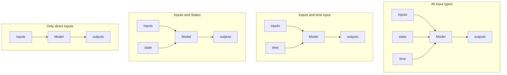
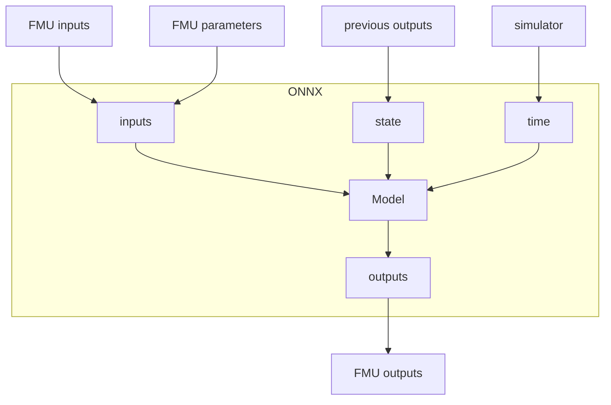

# ML Model

## Onnx file

There are some requirements for the onnx file to be compatible with this tool. This is so that the ML FMU tool knows how to connect the inputs and outputs of the onnx file to the FMU, to use it correctly.

If the model takes a single input and has a single output it is already compatible as long as the input and output is shaped as (1, X) and can be directly connected to the variables of the FMU.

### The possible configuration of inputs and outputs of the model



## Usage in FMU



## Tips and tricks

```diff
- TODO
```

## Examples

```diff
- TODO
```

### Model that only uses "pure" inputs and outputs

```python
class Model():
    num_inputs: int = 2
    num_outputs: int = 2

    ...

    def call(self, all_inputs):
        inputs, *_ = all_inputs

        # Do something with the inputs
        outputs = self.layers(inputs)

        return outputs
```

### Model using every input type

Say we have trained an ML model to predict the derivatives of outputs from some data as shown below:

```python
class DerivativePredictor():
    def call(self, all_inputs):
        prev_outputs, prev_inputs, curr_inputs, time = all_inputs

        # Do some ML stuff
        derivative = ...

        return derivative
```

However, the FMU we want to create cannot use the same inputs and outputs as the trained ML model.

We do not want to have previous inputs and outputs as inputs to the FMU. Instead we want it to remember the previous inputs and outputs itself. To do this we need to use the state inside the generated MLFMU using this tool.

We also do not want the FMU to output the derivative, but instead use the derivative to integrate the outputs. This makes it possible for the outputs themselves to be the output of the FMU.

To do this we need to make a wrapper around the trained ML model so that it is compatible with the tool and what we want the generated FMU to do.

``` python
class ModelWrapper():
    num_inputs: int = 2
    num_outputs: int = 2
    derivative_predictor: DerivativePredictor = None

    def call(self, all_inputs):
        # Unpack inputs
        inputs, state, time = all_inputs

        # Unpack state into what is known to be saved in state
        # What is contained in state is decided by what is output from this function and the state settings in interface.json
        previous_outputs = state[:,:self.num_outputs]
        previous_inputs = state[:,self.num_outputs:]

        # Unpack time input
        current_time =  all_inputs[:,:1]
        dt = all_inputs[:,1:2]

        # Predict something (e.g. a derivative) from the unpacked input data
        outputs_derivative = self.derivative_predictor([previous_outputs, previous_inputs, inputs, current_time])

        # Do other calculation to get data that needs to be output from the FMU
        outputs = previous_outputs + dt * output_derivative

        # Format outputs from the model to contain everything that needs to output from the FMU and/or saved as state
        # Saving the state is easier if outputs are in the same order as they are expected to be saved in state
        all_outputs = self.concat([outputs, inputs])

        return all_outputs
```
