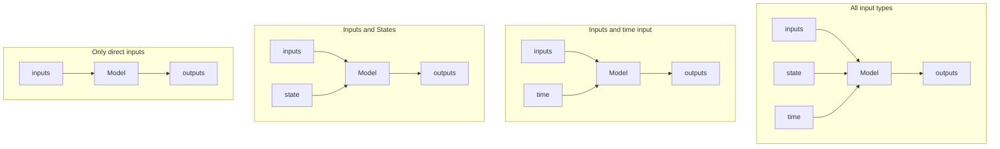
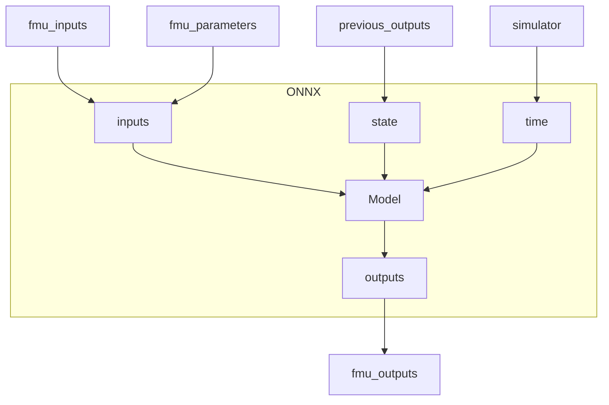

# ML Model

## Onnx file

There are some requirements put on the onnx file to be compatible with this tool.

```mermaid
graph TD;
subgraph 0["Only direct inputs"]
    inputs_3["inputs"]-->Model_3["Model"]
    Model_3["Model"]-->outputs_3["outputs"]
end

subgraph 3["All input types"]
    inputs_0["inputs"]-->Model_0["Model"]
    state_0["state"]-->Model_0["Model"]
    time_0["time"]-->Model_0["Model"]
    Model_0["Model"]-->outputs_0["outputs"]
end

subgraph 1["Inputs and States"]
    inputs_1["inputs"]-->Model_1["Model"]
    state_1["state"]-->Model_1["Model"]
    Model_1["Model"]-->outputs_1["outputs"]
end

subgraph 2["Inputs and time input"]
    inputs_2["inputs"]-->Model_2["Model"]
    time_2["time"]-->Model_2["Model"]
    Model_2["Model"]-->outputs_2["outputs"]
end

```

## Usage in FMU

```mermaid
graph TD;

    fmu_inputs-->inputs
    fmu_parameters-->inputs
    inputs --> Model

    previous_outputs --> state
    state --> Model
    
    simulator-->time
    time-->Model
   
    Model-->outputs
    outputs-->fmu_outputs

    subgraph ONNX
        inputs
        state
        time
        outputs
        Model
    end


    
```

## Tips and tricks

## Examples