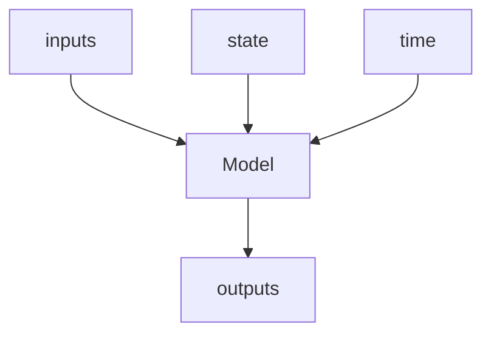
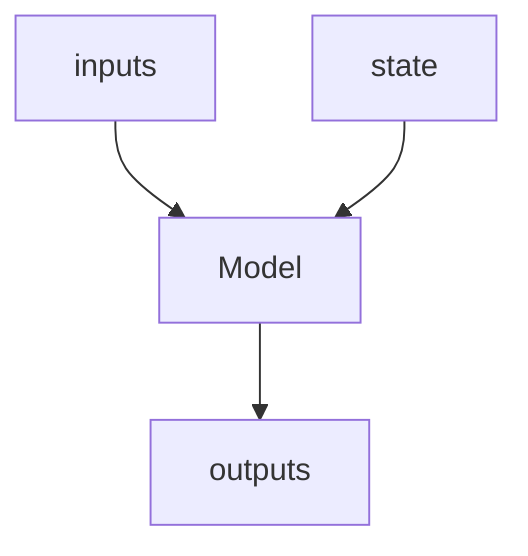
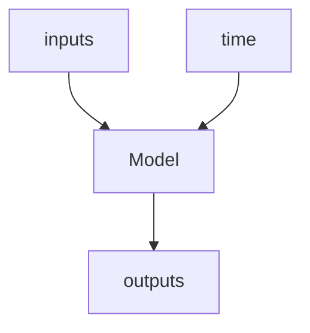
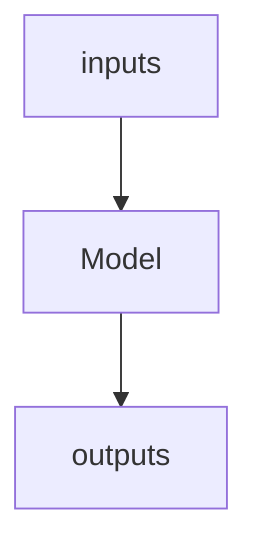
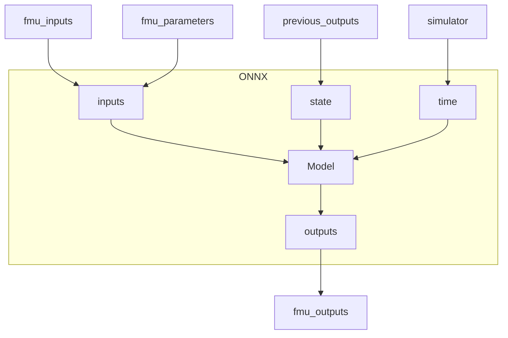

# ML Model

## Onnx file

There are some requirements put on the onnx file to be compatible with this tool.

```mermaid
graph TD;
    inputs-->Model
    state-->Model
    time-->Model
    Model-->outputs
```

```mermaid
graph TD;
    inputs-->Model
    state-->Model
    Model-->outputs
```

```mermaid
graph TD;
    inputs-->Model
    time-->Model
    Model-->outputs
```

```mermaid
graph TD;
    inputs-->Model
    Model-->outputs
```

## Usage in FMU

```mermaid
graph TD;

    fmu_inputs-->inputs
    fmu_parameters-->inputs
    inputs --> Model

    previous_outputs --> state
    state --> Model
    
    simulator-->time
    time-->Model
   
    Model-->outputs
    outputs-->fmu_outputs

    subgraph ONNX
        inputs
        state
        time
        outputs
        Model
    end


    
```

## Tips and tricks

## Examples